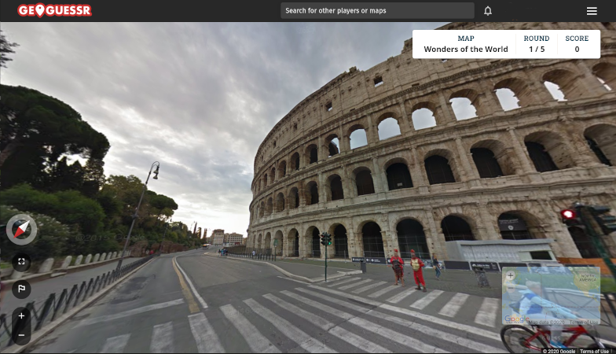

# geoguessrmaps
Python scripts to produce latitude, longitude coordinates for uploading to GeoGuessr's Map Maker.



## Setup API Keys
Place your Google Maps API key in `./.env`:

```
GOOGLE_API_KEY={secret_key}
```

## Maps
### WinCo Foods
Play: https://www.geoguessr.com/maps/5f4fbb99ef52fd00018796f6

WinCo Foods is an employee-owned grocery store chain in the Western US. The WinCo name comes from a 1999 company contest to rename the chain, which the winning name is a portmanteau of Winning Company and the states in which the chain operates in (Washington, Idaho, Nevada, California, and Oregon). But don't assume that they haven't expanded since then!

### Benson Bubblers
Play: 

In 1912, Simon Benson donated $10,000 for public water fountains around Portland, Oregon. These became known as "Benson Bubblers" because of the constant bubbly flow of water from the fountains. Combined, the fountains normally pour out close to 100,000 gallons of drinking water per day every day of the year, except during extremely cold weather. Today, they remain one of the most iconic features of the city.

## License
This is free and unencumbered software released into the public domain.
